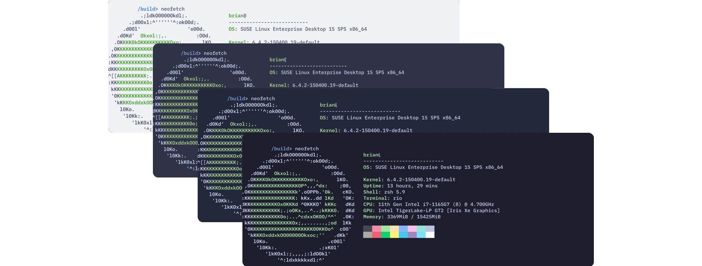
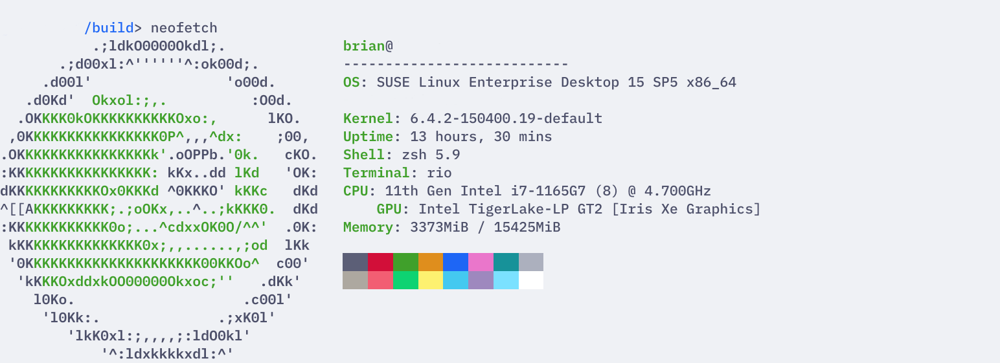
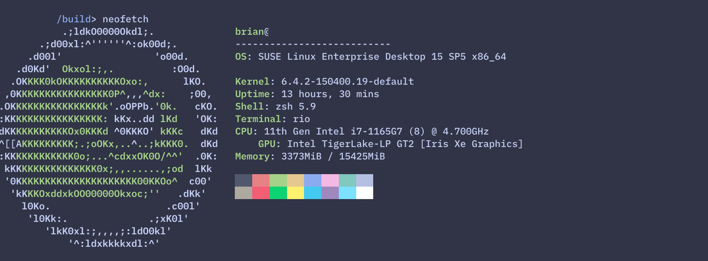
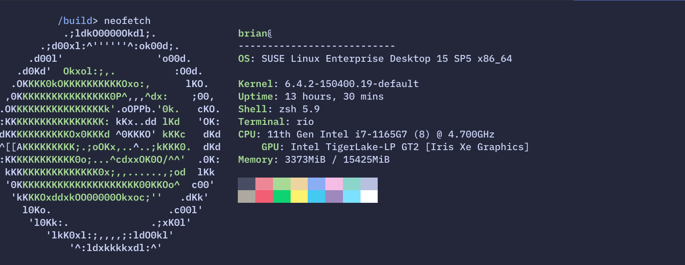
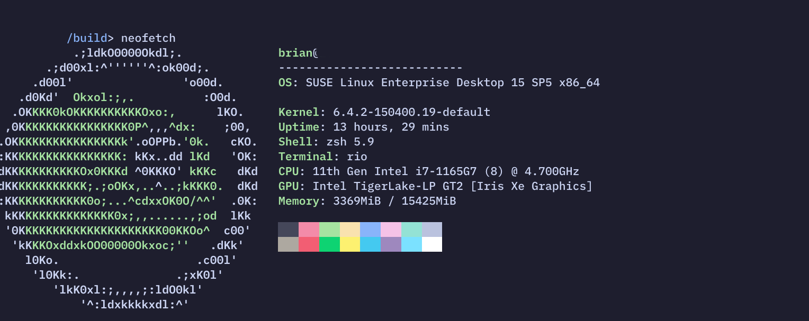

<h3 align="center">
	 
	
	Catppuccin for <a href="https://github.com/raphamorim/rio">Rio</a>
	
</h3>

	
	
	

	

## Previews

🌻 Latte

🪴 Frappé

🌺 Macchiato

🌿 Mocha

## Usage

1. Download your flavor of choice from [`themes/`](./themes/) to [Rio's theme directory](https://raphamorim.io/rio/docs/config/theme).
2. Edit your [Rio configuration file](https://raphamorim.io/rio/docs/config) and set `theme` to `catppuccin-<flavor>` (or simply the filename minus the extension of the file you previously downloaded).
3. Save your changes.

## 💝 Thanks to

- [Brian](https://github.com/Brianalmeida)

&nbsp;

	

	Copyright &copy; 2021-present <a href="https://github.com/catppuccin" target="_blank">Catppuccin Org</a>

	

